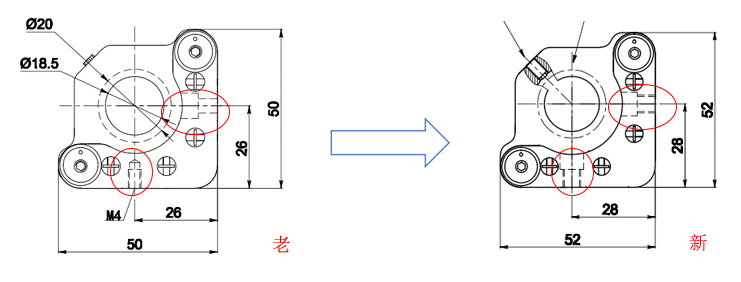
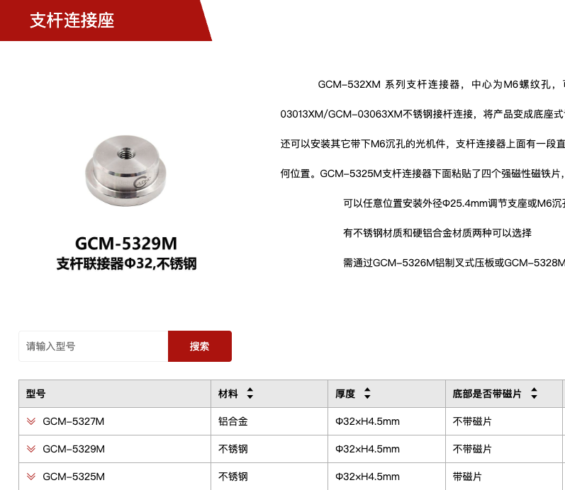

# 仪器安装步骤
#### 1.确保高度一致（光束处于同一水平面）
激光器不安装底部支架便于固定，将激光器抬高94.5mm；振镜通光孔朝上放置，在其上直接放置一45度反射镜架即可保证高度一致，建议使用M5六角螺丝固定。
#### 2.调整光路
反射镜使用磁吸底座，连接镜架的支杆直接放到底部无需使用旋钮调整高度。首次调整光路时无需严格确定激光器角度（因为只要能打到第一个反射镜上总能调整成水平），转动镜架调整得到期望光路（能打到振镜上的反射镜就行）后固定反射镜的位置，建议使用压板记录此时的位置，下次使用时只需转动激光器寻找正确角度。
#### 3.固定振镜，确保与工作平面平行
振镜通光孔朝上放置在实验台上，在其上单独放置一个反射镜架即可保证高度一致。首先使用压板和螺丝固定振镜和实验材料，确保二者平行。调整实验材料与场镜的距离为焦距。

#### 4.确保激光竖直射入振镜
随后调整45度反射镜使激光竖直射入振镜。

验证方法：任何水平入射场镜（竖直入射振镜相当于水平入射场镜）的光束会汇聚在工作平面的中心。根据振镜结构图光点的位置应距地面44mm，距振镜边缘53.5mm。
#  程序说明
## 使用说明：
1. 接线，激光器通过控制板开启PC control模式。

2. 修改main.m函数中的激光器串口名称和振镜串口名称为你使用的串口名称，设定你想要的激光器电压和频率。

3. 按指令顺序运行`main(dataPacketType);`函数，与激光器控制板相同。

   将dataPacketType变量更改为字符串类型的指令，运行顺序为：`'online_download'`  `'V_download'`  `'F_download'` `'stand_by'` `'Flash'` `'QSwitch'#此时出光，同时振镜开始偏转` `'QSwitch_close'`  `'Flash_close'` `'stand_by_close'` `'online_download_close'`

# 附
## *具体函数说明*
-  `closeup(portName)`
   -  在运行发送命令程序前运行此函数用于关闭串口，防止串口被占用，可指定串口，若不指定默认关闭所有找到的串口，会显示当前可用的串口。
-  `laser_control()`
   -  激光器出光控制函数，自行输入指令名称，与激光器触控板控制相似。
   -  发送成功串口命令后激光器会返回相同的命令，程序会转换成对应名称，说明激光器成功接收到了指令。
-  `move_to_position(serialPort, baudRate, focusX, focusY, focalLength)`
   -  让振镜移动到某个位置（前提是激光点位于工作平面上）。工作范围是X方向+55mm~-55mm，Y方向+55mm~-55mm的方形区域。振镜不会返回状态信息，只能根据模拟协议判断振镜的偏转角度，但通过示波器验证过模拟电压输出。
-  `grid_scan(serialPort, baudRate, xRange, yRange, gridSpacing, focalLength, pauseTime)`
   -  网格扫描，输入参数有X方向和Y方向区间，网格间距，场镜焦距以及每个点停留时间。
   -  应当在接收到激光器开启命令时启动此函数。
## *设备尺寸参数*

